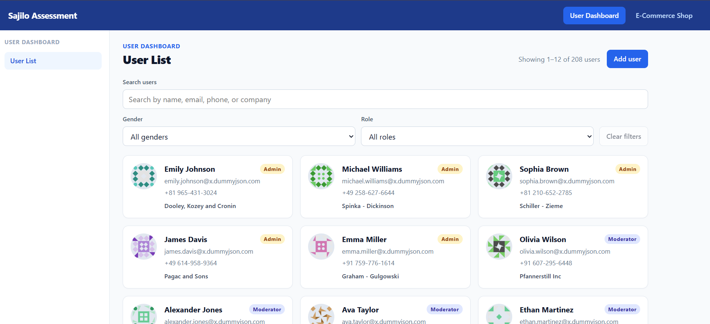
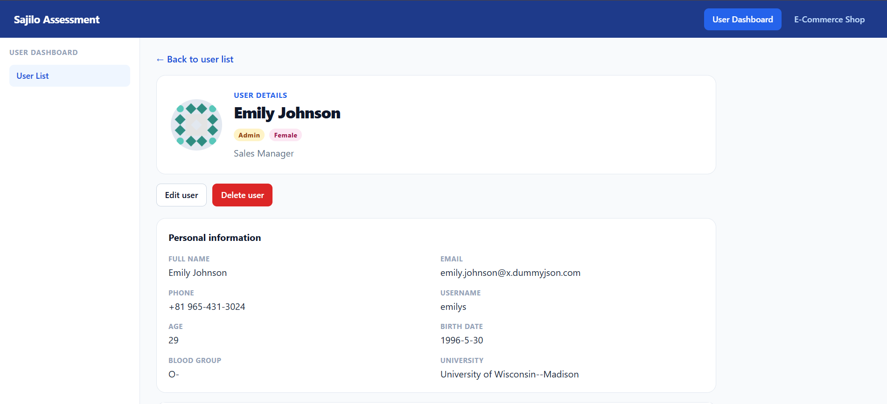
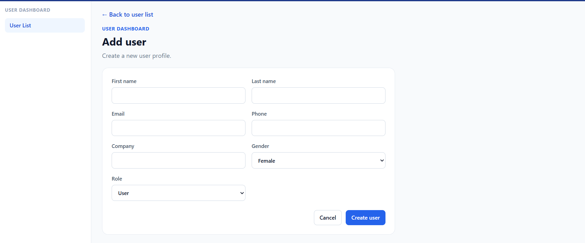
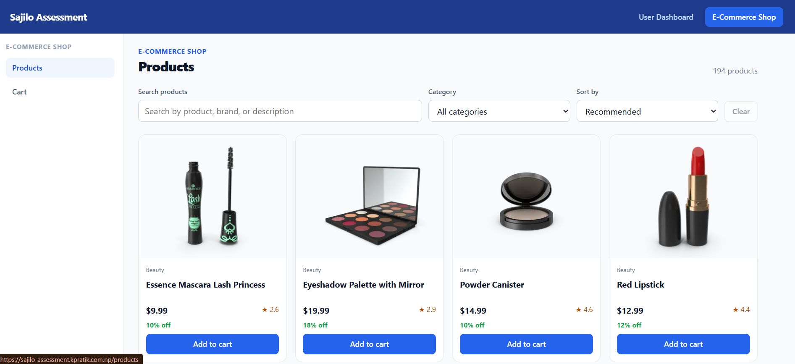
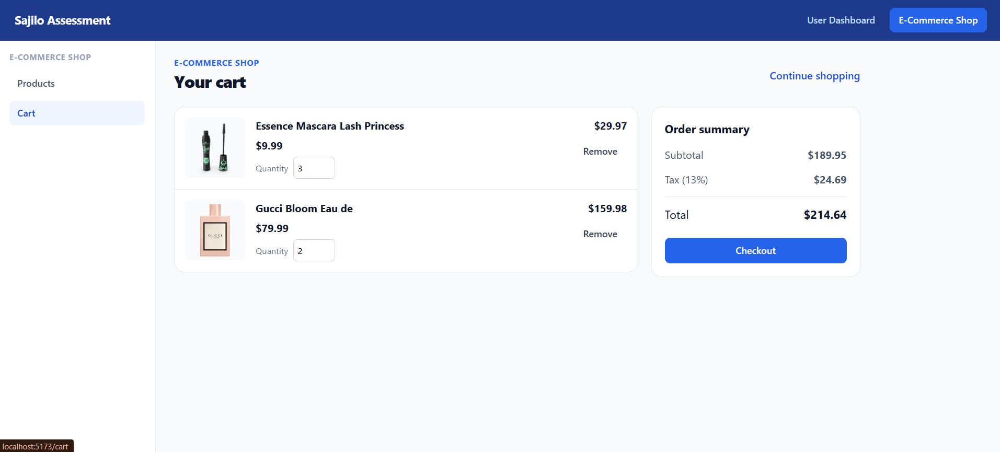
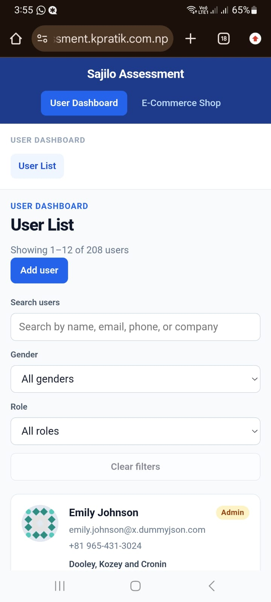

# Sajilo Assessment: User Management Dashboard + E-commerce Product & Cart

Technical assessment for the **React Developer Intern/Trainee** position at **Sajilo Life Pvt. Ltd.**

## Live Demo and Repository

- **Live app:** https://sajilo-assessment.kpratik.com.np
- **GitHub:** https://github.com/PratikKarki106/sajilo-assessment

## Project Overview

A single React application that contains both assessment projects:

1. **User Management Dashboard** (`/users`): browse, search, filter, view, add, edit and delete users.
2. **E-commerce Product & Cart** (`[/products]`): browse products, view details and manage a persistent shopping cart.

Both projects consume the public [DummyJSON](https://dummyjson.com) API.

## Technologies Used

| Area | Tool |
| --- | --- |
| UI library | React 19 |
| Build tool | Vite |
| Routing | React Router (`react-router-dom` v7) |
| HTTP client | Axios |
| Global state | React Context API |
| Local state and side effects | `useState`, `useEffect`, custom hooks |
| Persistence | `localStorage` (cart) |
| Linting | ESLint |
| Hosting | Vercel |

## Key Features

### Project 1: User Management Dashboard

- User list with profile image, full name, email, phone and company name
- Pagination
- Search
- Filtering by `[gender / role]`
- Loading, error and empty-result states
- Responsive layout
- Dynamic user details page (`/users/:id`) showing personal info, address, company and bank details, with navigation back to the list
- Add user form with controlled inputs and validation
- Edit user form, pre-populated with existing data, with validation
- Delete user with a confirmation step
- Submission/loading states and success/error feedback for every write action
- Friendly "user not found" state for invalid IDs

### Project 2: E-commerce Product & Cart

- Product list with image, title, price, rating and discount percentage
- Pagination
- Search
- Category filtering
- Sorting: price (low to high), price (high to low), rating
- Loading, error and empty-result states
- Dynamic product details page (`/products/:id`) with image gallery, description, brand, stock and reviews
- Add to cart
- Cart page: remove items, update quantity, subtotal, calculated tax and total
- Cart persisted in `localStorage`, so it survives a page refresh
- Empty cart state
- Friendly "product not found" state for invalid IDs

## Additional Features Implemented

## Project Structure


```text
src/
  components/   reusable UI components
  pages/        route-level pages
  hooks/        custom hooks
  services/     Axios instance and API calls
  context/      Context providers (cart, etc.)
  utils/        helpers
```

## Getting Started

### Prerequisites

- A recent Node.js LTS release (Vite requires a fairly new Node version, so use the latest LTS if the install fails)
- npm

### Installation

```bash
git clone https://github.com/PratikKarki106/sajilo-assessment.git
cd sajilo-assessment
npm install
```

### Run locally

```bash
npm run dev
```

Then open the URL printed in the terminal (Vite defaults to http://localhost:5173).

### Other scripts

```bash
npm run build     # production build into dist/
npm run preview   # serve the production build locally
npm run lint      # run ESLint
```

## API Information

Base URL: `https://dummyjson.com`

| Purpose | Method | Endpoint |
| --- | --- | --- |
| List users (paginated) | GET | `/users?limit=&skip=` |
| Search users | GET | `/users/search?q=` |
| Filter users | GET | `/users/filter?key=&value=` |
| Single user | GET | `/users/:id` |
| Add user | POST | `/users/add` |
| Update user | PUT | `/users/:id` |
| Delete user | DELETE | `/users/:id` |
| List products (paginated, sortable) | GET | `/products?limit=&skip=&sortBy=&order=` |
| Search products | GET | `/products/search?q=` |
| Product categories | GET | `/products/categories` |
| Products by category | GET | `/products/category/:category` |
| Single product | GET | `/products/:id` |


All requests go through a shared Axios instance in `[src/services/...]`.

## Assumptions

- **DummyJSON does not persist writes.** POST, PUT and DELETE return a simulated success response, but the data is not saved on the server. 
- Tax in the cart is calculated at a flat  rate on the subtotal.
- Cart data is stored in `localStorage` under the key `[key name]`.

## Technical Decisions

- **Axios with a service layer:** API calls live in a services folder instead of inside components, so components stay focused on rendering and the endpoints can be changed in one place.
- **Custom hooks for data fetching:** `[ e.g. useFetch / useUsers]` keep loading, error and data handling out of the pages and avoid repeating the same `useEffect` logic.
- **Context API for the cart:** the cart is shared across the product list, product details, navbar and cart page, so it lives in a context provider and is synced to `localStorage`. The brief asks for Context API, and the cart is small enough that a heavier state library would be unnecessary.
- **Explicit handling of edge cases:** API failure, empty search results, empty cart, invalid form data, page refresh and unknown user/product IDs each have a visible state rather than a blank screen.
- **Client-side routing on Vercel:** a `vercel.json` rewrite sends every path to `index.html`, so deep links and refreshes (for example `/users/5`) work.

## Screenshots

| Page | Screenshot |
| --- | --- |
| User list (desktop) |  |
| User details |  |
| Add / edit user form |  |
| Product list |  |
| Product details |  |
| Cart |  |
| Loading State | |
| Mobile view |  |


## Author

**Pratik Karki**
GitHub: [@PratikKarki106](https://github.com/PratikKarki106)
